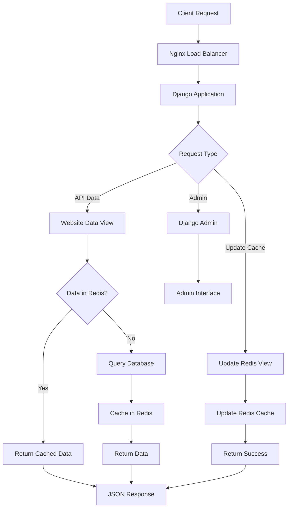
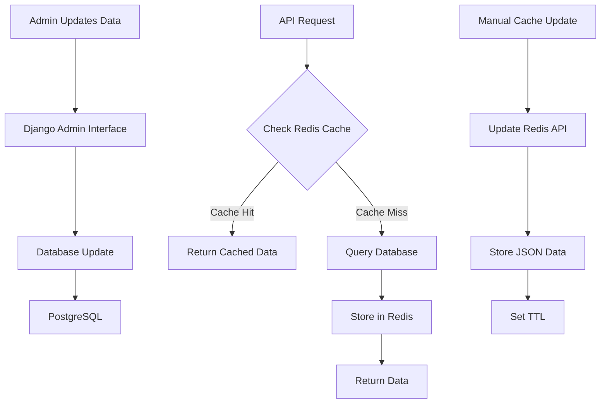
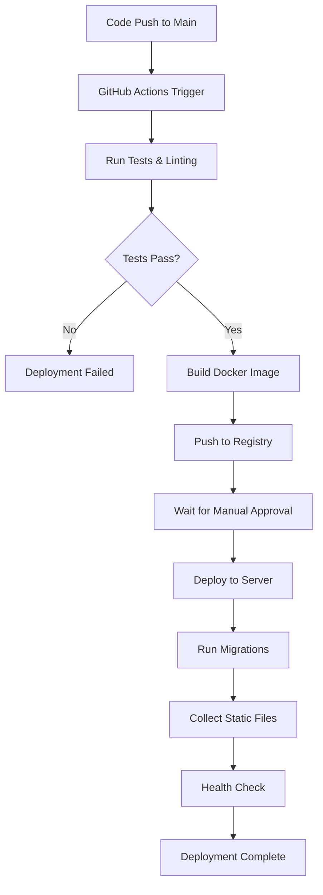
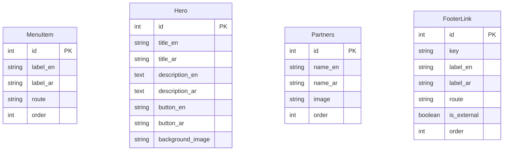
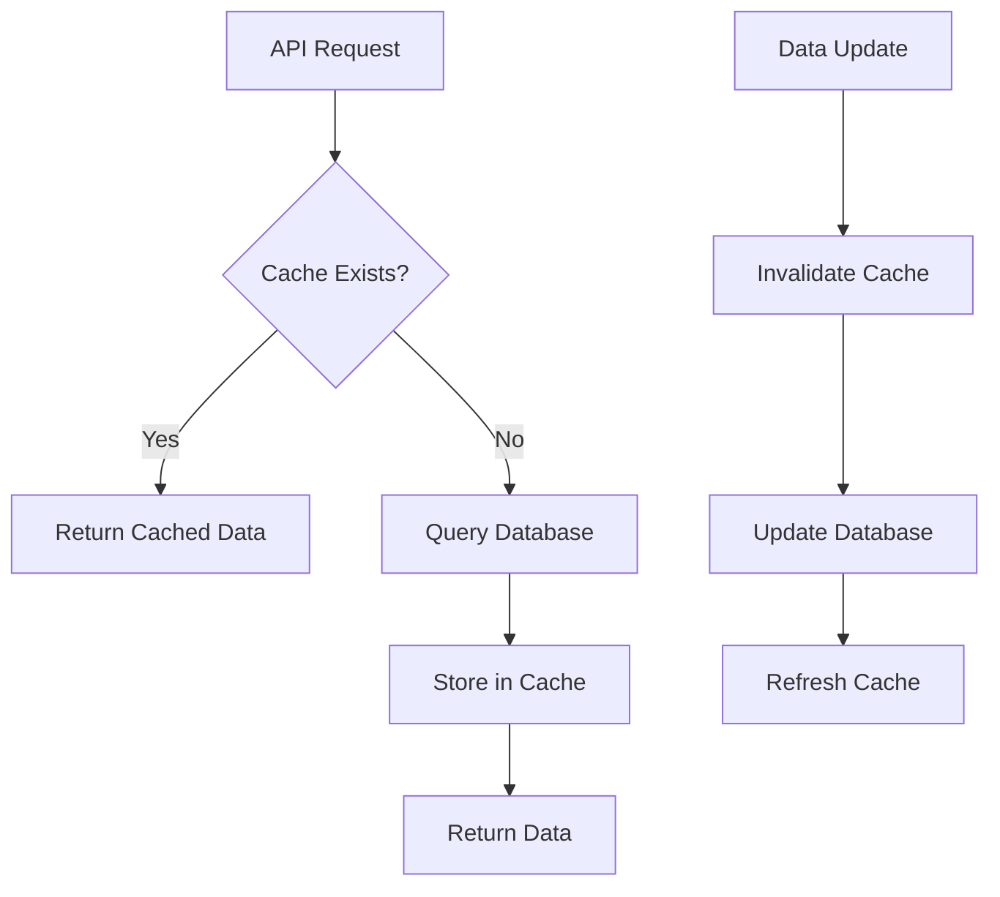
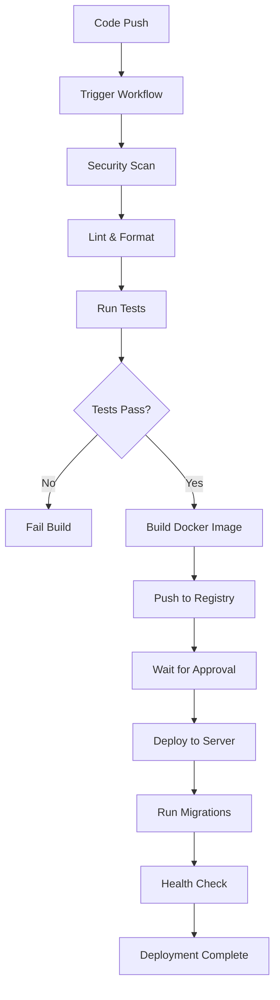

# 🏗️ ADMSC Backend - Architecture & Flows

This document provides a comprehensive overview of the ADMSC backend architecture, data flows, and system design.

## 📋 Table of Contents

1. [System Architecture](#system-architecture)
2. [Project Structure](#project-structure)
3. [Data Flow Diagrams](#data-flow-diagrams)
4. [API Architecture](#api-architecture)
5. [Database Design](#database-design)
6. [Caching Strategy](#caching-strategy)
7. [Deployment Architecture](#deployment-architecture)
8. [CI/CD Pipeline Flow](#cicd-pipeline-flow)
9. [Security Architecture](#security-architecture)
10. [Monitoring & Logging](#monitoring--logging)

---

## System Architecture

### High-Level Architecture

```
┌─────────────────────────────────────────────────────────────────┐
│                        Client Layer                             │
├─────────────────────────────────────────────────────────────────┤
│  Web Browser  │  Mobile App  │  Admin Panel  │  External APIs  │
└─────────────────────────────────────────────────────────────────┘
                                │
                                ▼
┌─────────────────────────────────────────────────────────────────┐
│                      Load Balancer (Nginx)                     │
│  • SSL Termination  • Rate Limiting  • Static File Serving    │
└─────────────────────────────────────────────────────────────────┘
                                │
                                ▼
┌─────────────────────────────────────────────────────────────────┐
│                    Django Application Layer                     │
│  ┌─────────────┐  ┌─────────────┐  ┌─────────────┐            │
│  │   Views     │  │   Models    │  │   Utils     │            │
│  │             │  │             │  │             │            │
│  │ • API Views │  │ • MenuItem  │  │ • Redis     │            │
│  │ • Webhooks  │  │ • Hero      │  │ • JSON Data │            │
│  │ • Admin     │  │ • Partners  │  │ • SEO Data  │            │
│  │             │  │ • FooterLink│  │             │            │
│  └─────────────┘  └─────────────┘  └─────────────┘            │
└─────────────────────────────────────────────────────────────────┘
                                │
                                ▼
┌─────────────────────────────────────────────────────────────────┐
│                      Data Layer                                 │
│  ┌─────────────┐  ┌─────────────┐  ┌─────────────┐            │
│  │ PostgreSQL  │  │    Redis    │  │   AWS S3    │            │
│  │             │  │             │  │             │            │
│  │ • User Data │  │ • Caching   │  │ • Static    │            │
│  │ • Content   │  │ • Sessions  │  │ • Media     │            │
│  │ • Metadata  │  │ • JSON Data │  │ • Backups   │            │
│  └─────────────┘  └─────────────┘  └─────────────┘            │
└─────────────────────────────────────────────────────────────────┘
```

### Technology Stack

- **Backend Framework**: Django 4.2.24
- **Database**: PostgreSQL 15
- **Cache**: Redis 7
- **Web Server**: Nginx (Production)
- **Containerization**: Docker & Docker Compose
- **Cloud Storage**: AWS S3 (Optional)
- **CI/CD**: GitHub Actions
- **Monitoring**: Custom health checks

---

## Project Structure

```
admsc-mm-backend/
├── 📁 apps/                          # Django Applications
│   └── website/                      # Main Website App
│       ├── models.py                 # Database Models
│       ├── views.py                  # API Views
│       ├── urls.py                   # URL Routing
│       ├── admin.py                  # Admin Interface
│       └── utils/                    # Utility Functions
│           ├── redis_client.py       # Redis Connection
│           ├── redis_test_json.py    # JSON Data
│           └── redis_seo.py          # SEO Data
├── 📁 config/                        # Django Configuration
│   └── settings/                     # Environment Settings
│       ├── base.py                   # Base Settings
│       ├── dev.py                    # Development
│       └── prod.py                   # Production
├── 📁 compose/                       # Docker Configurations
│   ├── dev/                          # Development Environment
│   └── prod/                         # Production Environment
├── 📁 docs/                          # Documentation
├── 📁 .github/workflows/             # CI/CD Pipelines
├── 📁 scripts/                       # Deployment Scripts
└── 📄 requirements/                  # Dependencies
```

---

## Data Flow Diagrams

### 1. API Request Flow



### 2. Data Storage Flow



### 3. Deployment Flow



---

## API Architecture

### RESTful API Design

#### **Base URL**: `http://localhost:8000`

#### **Endpoints**:

| Method | Endpoint | Description | Response |
|--------|----------|-------------|----------|
| `GET` | `/` | Home/Health Check | API Info |
| `GET` | `/api/website-data/` | Get All Website Data | JSON Data |
| `POST` | `/api/update-redis/` | Update Redis Cache | Success Status |
| `GET` | `/admin/` | Django Admin | Admin Interface |

#### **Response Format**:

```json
{
  "status": "success|error",
  "data": {...},
  "message": "Description",
  "timestamp": "2024-01-01T00:00:00Z"
}
```

### API Flow Architecture

```
Client Request
     │
     ▼
┌─────────────┐
│   Nginx     │ ← SSL Termination, Rate Limiting
└─────────────┘
     │
     ▼
┌─────────────┐
│   Django    │ ← URL Routing, Authentication
│   Views     │
└─────────────┘
     │
     ▼
┌─────────────┐
│   Business  │ ← Data Processing, Validation
│   Logic     │
└─────────────┘
     │
     ▼
┌─────────────┐
│   Data      │ ← Database, Cache, External APIs
│   Layer     │
└─────────────┘
     │
     ▼
┌─────────────┐
│   Response  │ ← JSON, Error Handling
└─────────────┘
```

---

## Database Design

### Entity Relationship Diagram



### Database Schema

```sql
-- Menu Items Table
CREATE TABLE website_menuitem (
    id SERIAL PRIMARY KEY,
    label_en VARCHAR(255) NOT NULL,
    label_ar VARCHAR(255),
    route VARCHAR(255) NOT NULL,
    order INTEGER DEFAULT 0
);

-- Hero Section Table
CREATE TABLE website_hero (
    id SERIAL PRIMARY KEY,
    title_en VARCHAR(255) NOT NULL,
    title_ar VARCHAR(255),
    description_en TEXT,
    description_ar TEXT,
    button_en VARCHAR(255),
    button_ar VARCHAR(255),
    background_image VARCHAR(512)
);

-- Partners Table
CREATE TABLE website_partners (
    id SERIAL PRIMARY KEY,
    name_en VARCHAR(100) NOT NULL,
    name_ar VARCHAR(100),
    image VARCHAR(512) NOT NULL,
    order INTEGER DEFAULT 0
);

-- Footer Links Table
CREATE TABLE website_footerlink (
    id SERIAL PRIMARY KEY,
    key VARCHAR(64) NOT NULL,
    label_en VARCHAR(255) NOT NULL,
    label_ar VARCHAR(255),
    route VARCHAR(255) NOT NULL,
    is_external BOOLEAN DEFAULT FALSE,
    order INTEGER DEFAULT 0
);
```

---

## Caching Strategy

### Redis Cache Architecture

```
┌─────────────────────────────────────────────────────────────┐
│                    Redis Cache Layer                        │
├─────────────────────────────────────────────────────────────┤
│  Key Pattern          │  Data Type  │  TTL    │  Purpose    │
├─────────────────────────────────────────────────────────────┤
│  website_data         │  JSON       │  1h     │  API Cache  │
│  home_page            │  JSON       │  1h     │  Page Data  │
│  seo_data             │  JSON       │  1h     │  SEO Info   │
│  menu_items           │  JSON       │  30m    │  Navigation │
│  heroes               │  JSON       │  30m    │  Hero Data  │
│  partners             │  JSON       │  30m    │  Partners   │
│  footer_links         │  JSON       │  30m    │  Footer     │
└─────────────────────────────────────────────────────────────┘
```

### Cache Invalidation Strategy

1. **Time-based**: Automatic expiration via TTL
2. **Manual**: Admin-triggered cache updates
3. **Event-based**: Database changes trigger cache refresh

### Cache Flow



---

## Deployment Architecture

### Production Environment

```
┌─────────────────────────────────────────────────────────────┐
│                    Digital Ocean Droplet                    │
├─────────────────────────────────────────────────────────────┤
│  ┌─────────────┐  ┌─────────────┐  ┌─────────────┐        │
│  │   Nginx     │  │   Django    │  │ PostgreSQL  │        │
│  │             │  │   App       │  │             │        │
│  │ • SSL       │  │ • Gunicorn  │  │ • Database  │        │
│  │ • Proxy     │  │ • Workers   │  │ • Migrations│        │
│  │ • Static    │  │ • API       │  │ • Backups   │        │
│  └─────────────┘  └─────────────┘  └─────────────┘        │
│                                                             │
│  ┌─────────────┐  ┌─────────────┐  ┌─────────────┐        │
│  │   Redis     │  │   Certbot   │  │   Docker    │        │
│  │             │  │             │  │             │        │
│  │ • Cache     │  │ • SSL Certs │  │ • Containers│        │
│  │ • Sessions  │  │ • Auto-renew│  │ • Compose   │        │
│  │ • JSON Data │  │ • Let's Encrypt│ • Volumes   │        │
│  └─────────────┘  └─────────────┘  └─────────────┘        │
└─────────────────────────────────────────────────────────────┘
```

### Container Architecture

```yaml
# Docker Compose Services
services:
  web:          # Django Application
    - Gunicorn WSGI Server
    - Django App
    - API Endpoints

  nginx:        # Reverse Proxy
    - SSL Termination
    - Static File Serving
    - Load Balancing

  db:           # PostgreSQL Database
    - Data Storage
    - Migrations
    - Backups

  redis:        # Cache Layer
    - Session Storage
    - API Caching
    - JSON Data

  certbot:      # SSL Management
    - Let's Encrypt
    - Auto-renewal
    - Certificate Management
```

---

## CI/CD Pipeline Flow

### GitHub Actions Workflow



### Pipeline Stages

1. **Security Scan**
   - Bandit security analysis
   - Safety dependency check
   - Vulnerability scanning

2. **Code Quality**
   - Black code formatting
   - Isort import sorting
   - Flake8 linting
   - MyPy type checking

3. **Testing**
   - Unit tests with pytest
   - Coverage reporting
   - Database testing
   - Redis testing

4. **Build & Deploy**
   - Docker image build
   - Container registry push
   - Server deployment
   - Health verification

---

## Security Architecture

### Security Layers

```
┌─────────────────────────────────────────────────────────────┐
│                    Security Layers                          │
├─────────────────────────────────────────────────────────────┤
│  Layer 1: Network Security                                 │
│  • UFW Firewall                                            │
│  • Fail2ban Protection                                     │
│  • DDoS Mitigation                                         │
├─────────────────────────────────────────────────────────────┤
│  Layer 2: Application Security                             │
│  • HTTPS/SSL Encryption                                    │
│  • CSRF Protection                                         │
│  • XSS Prevention                                          │
│  • SQL Injection Protection                                │
├─────────────────────────────────────────────────────────────┤
│  Layer 3: Data Security                                    │
│  • Database Encryption                                     │
│  • Redis Security                                          │
│  • Secret Management                                       │
├─────────────────────────────────────────────────────────────┤
│  Layer 4: Access Control                                   │
│  • Authentication                                          │
│  • Authorization                                           │
│  • API Rate Limiting                                       │
└─────────────────────────────────────────────────────────────┘
```

### Security Measures

- **HTTPS**: SSL/TLS encryption for all communications
- **CSRF Protection**: Cross-site request forgery prevention
- **XSS Protection**: Cross-site scripting prevention
- **SQL Injection**: Parameterized queries and ORM
- **Rate Limiting**: API request throttling
- **Firewall**: UFW configuration for port access
- **Fail2ban**: Intrusion detection and prevention
- **Secret Management**: Environment variables for sensitive data

---

## Monitoring & Logging

### Health Check System

```python
# Health Check Endpoints
GET /health/                    # Basic health check
GET /api/website-data/         # API functionality
GET /admin/                    # Admin access
```

### Logging Strategy

```
┌─────────────────────────────────────────────────────────────┐
│                    Logging Architecture                     │
├─────────────────────────────────────────────────────────────┤
│  Application Logs                                          │
│  • Django logs                                             │
│  • API request logs                                        │
│  • Error logs                                              │
├─────────────────────────────────────────────────────────────┤
│  System Logs                                               │
│  • Docker container logs                                   │
│  • Nginx access logs                                       │
│  • Database logs                                           │
├─────────────────────────────────────────────────────────────┤
│  Security Logs                                             │
│  • Authentication logs                                     │
│  • Failed login attempts                                   │
│  • Security events                                         │
└─────────────────────────────────────────────────────────────┘
```

### Monitoring Scripts

```bash
# Health Check Script
/opt/monitor.sh              # System status
/opt/log-monitor.sh          # Application logs
/opt/backup-monitor.sh       # Backup status
```

---

## Performance Optimization

### Caching Strategy

- **Redis Caching**: API responses cached for 1 hour
- **Database Query Optimization**: Efficient ORM queries
- **Static File Optimization**: Nginx serving with compression
- **CDN Integration**: AWS S3 for static assets

### Scalability Considerations

- **Horizontal Scaling**: Multiple Django workers
- **Database Scaling**: Read replicas for read-heavy operations
- **Cache Scaling**: Redis cluster for high availability
- **Load Balancing**: Nginx load balancer configuration

---

## Development Workflow

### Local Development

1. **Environment Setup**
   ```bash
   git clone <repository>
   cd admsc-mm-backend
   docker compose -f compose/dev/docker-compose.yml up
   ```

2. **Code Changes**
   - Make changes to code
   - Run tests locally
   - Commit and push

3. **Testing**
   - Unit tests
   - Integration tests
   - API testing

### Production Deployment

1. **Code Push**
   - Push to main branch
   - Trigger CI/CD pipeline

2. **Approval Process**
   - Manual approval required
   - Security review
   - Performance validation

3. **Deployment**
   - Automated deployment
   - Health checks
   - Rollback capability

---

## Troubleshooting Guide

### Common Issues

1. **Database Connection Issues**
   - Check PostgreSQL service
   - Verify connection strings
   - Check network connectivity

2. **Redis Connection Issues**
   - Check Redis service
   - Verify Redis URL
   - Check authentication

3. **API Response Issues**
   - Check Django logs
   - Verify URL routing
   - Check data validation

4. **Deployment Issues**
   - Check Docker logs
   - Verify environment variables
   - Check server resources

### Debug Commands

```bash
# Check container status
docker compose ps

# View logs
docker compose logs -f

# Check health
curl http://localhost:8000/health/

# Test API
curl http://localhost:8000/api/website-data/
```

---

*This document provides a comprehensive overview of the ADMSC backend architecture and flows. For specific implementation details, refer to the individual component documentation.*
