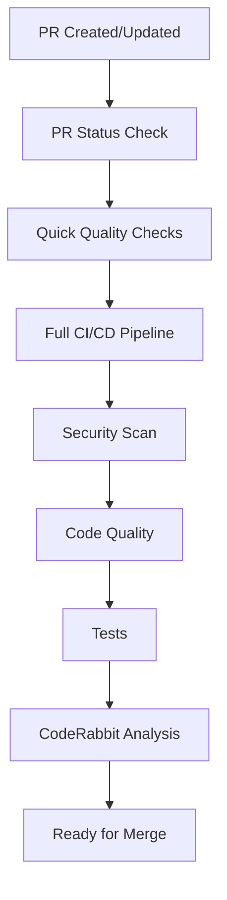
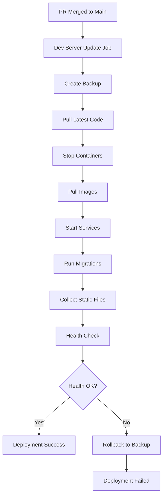

# 🚀 Complete CI/CD Flow Documentation

This document explains the comprehensive CI/CD pipeline that handles PR checks, CodeRabbit analysis, automatic deployments, rollbacks, and manual interventions.

## 📋 Table of Contents

1. [Overview](#overview)
2. [PR Flow](#pr-flow)
3. [Deployment Flow](#deployment-flow)
4. [Rollback & Recovery](#rollback--recovery)
5. [Manual Operations](#manual-operations)
6. [Configuration](#configuration)
7. [Troubleshooting](#troubleshooting)

---

## Overview

The complete CI/CD pipeline consists of multiple workflows that work together to provide:

- ✅ **Automated PR checks** (quality, security, tests)
- ✅ **CodeRabbit AI analysis** with diagrams and explanations
- ✅ **Automatic dev server deployment** after PR merge
- ✅ **Manual production deployment** with approval
- ✅ **Rollback functionality** for failed deployments
- ✅ **Manual update capabilities** for emergency fixes

---

## PR Flow

### 1. PR Creation & Checks

When a PR is created or updated:



### 2. PR Status Check (`pr-status.yml`)

**Triggers**: PR opened, synchronized, reopened, closed
**Purpose**: Quick validation and status reporting

**What it does**:
- ✅ Code formatting check (Black)
- ✅ Import sorting check (isort)
- ✅ Code quality check (Flake8)
- ✅ Type checking (MyPy)
- ✅ Posts status report to PR

### 3. Complete CI/CD Pipeline (`complete-cicd.yml`)

**Triggers**: PR events, push to main, manual dispatch
**Purpose**: Comprehensive checks and deployments

#### PR Checks Job (`pr-checks`)
- 🔒 **Security Scan**: Bandit, Safety
- 🔍 **Code Quality**: Black, isort, Flake8, MyPy
- 🧪 **Tests**: pytest with coverage
- 📊 **Coverage Report**: Uploaded as artifact

#### CodeRabbit Analysis Job (`code-rabbit-analysis`)
- 🤖 **AI Code Analysis**: Detailed code review
- 📈 **Flow Diagrams**: Mermaid diagrams for code flow
- 📝 **Recommendations**: Best practices and improvements
- 💬 **PR Comments**: Sticky comments with analysis

---

## Deployment Flow

### 1. Automatic Dev Server Deployment

**Triggers**: Push to main branch
**Purpose**: Automatically deploy merged changes to development server



**What it does**:
1. **Creates backup** of current deployment
2. **Pulls latest code** from main branch
3. **Updates Docker containers** with new images
4. **Runs database migrations**
5. **Collects static files**
6. **Performs health check**
7. **Rolls back** if health check fails

### 2. Manual Production Deployment

**Triggers**: Manual workflow dispatch
**Purpose**: Deploy to production with approval

**Steps**:
1. **Manual trigger** via GitHub Actions
2. **Confirmation required** (type "CONFIRM")
3. **Same process** as dev deployment
4. **Production-specific** environment variables
5. **Health check** and rollback on failure

---

## Rollback & Recovery

### 1. Automatic Rollback

**When it happens**:
- Health check fails after deployment
- Database migration errors
- Service startup failures

**What it does**:
1. **Stops new deployment**
2. **Restores from backup**
3. **Restarts previous version**
4. **Sends notification**

### 2. Manual Rollback

**Triggers**: Manual workflow dispatch
**Purpose**: Revert specific changes

**Options**:
- **Revert specific PR**: Using PR number
- **Revert to previous commit**: Git revert
- **Full rollback**: Restore from backup

### 3. PR Revert Workflow (`revert-pr.yml`)

**Purpose**: Revert specific PR changes

**Steps**:
1. **Enter PR number** to revert
2. **Type "REVERT"** to confirm
3. **Finds merge commit** of the PR
4. **Creates revert commit**
5. **Pushes to main branch**
6. **Comments on original PR**

---

## Manual Operations

### 1. Manual Deploy

**When to use**: Emergency deployments, hotfixes

**Steps**:
1. Go to **Actions** → **Complete CI/CD Pipeline**
2. Click **Run workflow**
3. Select **action: deploy**
4. Select **environment: production**
5. Type **"CONFIRM"** in confirmation field
6. Click **Run workflow**

### 2. Manual Update

**When to use**: Server issues, manual fixes

**Steps**:
1. Go to **Actions** → **Complete CI/CD Pipeline**
2. Click **Run workflow**
3. Select **action: manual-update**
4. Select **environment: development**
5. Type **"CONFIRM"** in confirmation field
6. Click **Run workflow**

### 3. Rollback

**When to use**: Failed deployments, critical issues

**Steps**:
1. Go to **Actions** → **Complete CI/CD Pipeline**
2. Click **Run workflow**
3. Select **action: rollback**
4. Select **environment: production**
5. Type **"CONFIRM"** in confirmation field
6. Click **Run workflow**

---

## Configuration

### Required GitHub Secrets

```bash
# Development Server
DEV_HOST=your-dev-server-ip
DEV_USERNAME=your-username
DEV_SSH_KEY=your-private-ssh-key
DEV_PORT=22

# Production Server
PROD_HOST=your-prod-server-ip
PROD_USERNAME=your-username
PROD_SSH_KEY=your-private-ssh-key
PROD_PORT=22
PROD_DOMAIN=your-domain.com

# GitHub
GITHUB_TOKEN=your-github-token

# Optional
SLACK_WEBHOOK=your-slack-webhook-url
OPENAI_API_KEY=your-openai-key
```

### Server Setup

**Development Server**:
```bash
# App directory
/opt/admsc-backend-dev

# Docker compose file
compose/prod/docker-compose.yml

# Environment file
.env.prod
```

**Production Server**:
```bash
# App directory
/opt/admsc-backend

# Docker compose file
compose/prod/docker-compose.yml

# Environment file
.env.prod
```

---

## Workflow Files

### 1. `complete-cicd.yml`
- **Main CI/CD pipeline**
- **PR checks and analysis**
- **Automatic dev deployment**
- **Manual production deployment**
- **Rollback functionality**

### 2. `pr-status.yml`
- **Quick PR validation**
- **Status reporting**
- **Immediate feedback**

### 3. `revert-pr.yml`
- **PR-specific rollback**
- **Revert specific changes**
- **PR commenting**

---

## Troubleshooting

### Common Issues

#### 1. "No jobs run" on PR
**Cause**: Workflow not properly configured
**Solution**: Check workflow triggers and file paths

#### 2. Deployment fails
**Cause**: Server issues, configuration problems
**Solution**: Check logs, verify secrets, manual rollback

#### 3. Health check fails
**Cause**: Application errors, database issues
**Solution**: Check application logs, verify database connection

#### 4. Rollback fails
**Cause**: Backup issues, Git problems
**Solution**: Manual intervention, restore from backup

### Debug Commands

```bash
# Check workflow status
gh run list

# View workflow logs
gh run view <run-id>

# Check server status
ssh user@server "docker compose ps"

# View application logs
ssh user@server "docker compose logs -f web"

# Manual rollback
ssh user@server "cd /opt/admsc-backend && git revert HEAD"
```

### Monitoring

**Success Indicators**:
- ✅ All PR checks pass
- ✅ CodeRabbit analysis completes
- ✅ Dev deployment succeeds
- ✅ Health check passes
- ✅ Production deployment succeeds

**Failure Indicators**:
- ❌ Any check fails
- ❌ Deployment timeout
- ❌ Health check fails
- ❌ Service startup errors

---

## Best Practices

### 1. PR Management
- **Small PRs**: Easier to review and rollback
- **Clear descriptions**: Help with rollback decisions
- **Test thoroughly**: Reduce deployment failures

### 2. Deployment
- **Monitor logs**: Watch deployment progress
- **Health checks**: Verify application status
- **Backup strategy**: Regular backups before deployment

### 3. Rollback
- **Quick response**: Rollback immediately on failure
- **Communication**: Notify team of rollback
- **Investigation**: Find root cause of failure

### 4. Monitoring
- **Set up alerts**: Slack notifications for failures
- **Regular checks**: Monitor application health
- **Log analysis**: Review logs for issues

---

## Security Considerations

### 1. Secret Management
- **Use GitHub Secrets**: Never hardcode credentials
- **Rotate regularly**: Update secrets periodically
- **Limit access**: Restrict secret access

### 2. Server Security
- **SSH keys**: Use key-based authentication
- **Firewall**: Restrict server access
- **Updates**: Keep server software updated

### 3. Code Security
- **Security scans**: Automated vulnerability checks
- **Dependency updates**: Keep dependencies current
- **Code review**: Manual security review

---

## Support

### Getting Help

1. **Check logs**: Review workflow and application logs
2. **Verify configuration**: Check secrets and settings
3. **Test manually**: Run commands manually on server
4. **Contact team**: Reach out for assistance

### Emergency Procedures

1. **Immediate rollback**: Use manual rollback workflow
2. **Server access**: SSH to server for manual fixes
3. **Database restore**: Restore from backup if needed
4. **Communication**: Notify team of emergency

---

*This CI/CD pipeline provides comprehensive automation with safety mechanisms for reliable deployments.*
