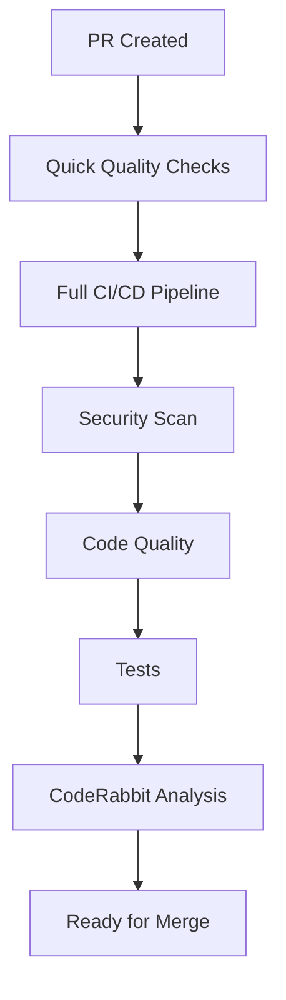
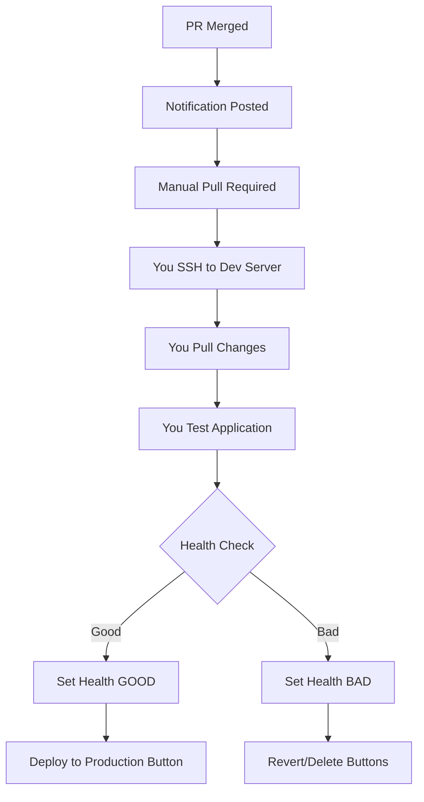

# 🎛️ Manual Deployment Workflow

This document explains the manual deployment workflow where you (amal-googerit) control the deployment process and use GitHub Actions buttons to manage PRs.

## 📋 Overview

The workflow is designed to give you complete control over deployments:

1. **PR is merged** → Notification posted in PR
2. **You manually pull** changes on your development server
3. **You test and set health status** (GOOD or BAD)
4. **Based on health status**, different buttons appear in PR
5. **You can revert, delete branch, or deploy to production**

---

## 🔄 Complete Workflow

### 1. PR Creation & Checks

When a PR is created:



### 2. PR Merge & Notification

When PR is merged to main:



---

## 🛠️ Manual Process

### Step 1: PR is Merged

- ✅ **Automatic notification** posted in PR
- ✅ **Instructions provided** for manual deployment
- ✅ **Management interface** shows available actions

### Step 2: You Manually Deploy

SSH to your development server:

```bash
# SSH to your development server
ssh user@your-dev-server

# Navigate to app directory
cd /opt/admsc-backend-dev

# Pull latest changes
git pull origin main

# Restart services
docker compose -f compose/prod/docker-compose.yml down
docker compose -f compose/prod/docker-compose.yml up --build -d

# Test the application
curl http://localhost:8000/health/
curl http://localhost:8000/api/website-data/
```

### Step 3: Set Health Status

Use the health status script:

```bash
# Set health status to GOOD (if everything works)
./scripts/set-health-status.sh 123 GOOD

# Set health status to BAD (if something fails)
./scripts/set-health-status.sh 123 BAD
```

Or use the API directly:

```bash
# Set health status to GOOD
curl -X POST http://localhost:8000/api/health/set \
  -H "Content-Type: application/json" \
  -H "User-Agent: amal-googerit" \
  -d '{"status": "GOOD", "pr_number": "123"}'

# Set health status to BAD
curl -X POST http://localhost:8000/api/health/set \
  -H "Content-Type: application/json" \
  -H "User-Agent: amal-googerit" \
  -d '{"status": "BAD", "pr_number": "123"}'
```

---

## 🎛️ PR Management Buttons

### If Health Status is BAD

The following buttons will appear in the PR (only visible to @amal-googerit):

#### 🔄 Revert PR
- **Action**: Reverts the PR changes from main branch
- **Result**: Main branch goes back to previous commit
- **PR Status**: Becomes un-merged

#### 🗑️ Delete Branch
- **Action**: Deletes the feature branch
- **Result**: Removes all changes made in the branch
- **PR Status**: Branch is deleted

### If Health Status is GOOD

The following button will appear in the PR (only visible to @amal-googerit):

#### 🚀 Deploy to Production
- **Action**: Triggers automated production deployment
- **Result**: Deploys current main branch to production server
- **Process**: Full automated deployment with health checks

---

## 🔧 Using the Management Buttons

### Accessing the Buttons

1. **Go to GitHub Actions** in your repository
2. **Click "PR Management Actions"**
3. **Click "Run workflow"**
4. **Select the action** you want to perform
5. **Enter the PR number**
6. **Type "CONFIRM"** to proceed
7. **Click "Run workflow"**

### Available Actions

| Action | Description | When to Use |
|--------|-------------|-------------|
| `revert` | Revert PR changes from main | Health check failed |
| `delete-branch` | Delete the feature branch | Health check failed |
| `deploy-production` | Deploy to production | Health check passed |
| `set-health-good` | Set health status to GOOD | After successful testing |
| `set-health-bad` | Set health status to BAD | After failed testing |

---

## 📊 Health Status Management

### Setting Health Status

#### Method 1: Using the Script (Recommended)

```bash
# Make the script executable (one time)
chmod +x scripts/set-health-status.sh

# Set health status to GOOD
./scripts/set-health-status.sh 123 GOOD

# Set health status to BAD
./scripts/set-health-status.sh 123 BAD
```

#### Method 2: Using the API

```bash
# Set health status to GOOD
curl -X POST http://localhost:8000/api/health/set \
  -H "Content-Type: application/json" \
  -H "User-Agent: amal-googerit" \
  -d '{"status": "GOOD", "pr_number": "123"}'

# Set health status to BAD
curl -X POST http://localhost:8000/api/health/set \
  -H "Content-Type: application/json" \
  -H "User-Agent: amal-googerit" \
  -d '{"status": "BAD", "pr_number": "123"}'
```

#### Method 3: Using GitHub Actions

1. Go to **Actions** → **PR Management Actions**
2. Select action: `set-health-good` or `set-health-bad`
3. Enter PR number
4. Type "CONFIRM"
5. Run workflow

### Checking Health Status

```bash
# Check latest health status
curl http://localhost:8000/api/health/status/

# Check specific PR health status
curl "http://localhost:8000/api/health/status/?pr_number=123"
```

---

## 🔒 Security & Permissions

### User Restrictions

- **Only @amal-googerit** can see and use the management buttons
- **Only @amal-googerit** can set health status via API
- **Only @amal-googerit** can trigger management actions

### Authentication

The system uses multiple authentication methods:

1. **GitHub Actions**: Uses GitHub's built-in authentication
2. **API Endpoints**: Checks for amal-googerit in User-Agent
3. **Script Execution**: Validates username before running

---

## 📱 API Endpoints

### Health Status Endpoints

| Method | Endpoint | Description |
|--------|----------|-------------|
| `GET` | `/api/health/status/` | Get current health status |
| `POST` | `/api/health/set/` | Set health status (amal-googerit only) |

### Example API Usage

```bash
# Get health status
curl http://localhost:8000/api/health/status/

# Set health status (requires amal-googerit authentication)
curl -X POST http://localhost:8000/api/health/set \
  -H "Content-Type: application/json" \
  -H "User-Agent: amal-googerit" \
  -d '{"status": "GOOD", "pr_number": "123"}'
```

---

## 🚨 Troubleshooting

### Common Issues

#### 1. "No jobs run" on PR
**Cause**: Workflow not properly configured
**Solution**: Check workflow triggers and file paths

#### 2. Health status not updating
**Cause**: API not accessible or authentication failed
**Solution**: Check if Django app is running and accessible

#### 3. Management buttons not visible
**Cause**: Not logged in as amal-googerit
**Solution**: Make sure you're logged in as @amal-googerit

#### 4. Script permission denied
**Cause**: Script not executable
**Solution**: Run `chmod +x scripts/set-health-status.sh`

### Debug Commands

```bash
# Check if API is accessible
curl http://localhost:8000/api/health/status/

# Check Django logs
docker compose logs -f web

# Check Redis status
docker compose logs -f redis

# Test health status setting
./scripts/set-health-status.sh 123 GOOD
```

---

## 📋 Best Practices

### 1. Testing Before Setting Health Status

Always test thoroughly before setting health status:

```bash
# Test all endpoints
curl http://localhost:8000/
curl http://localhost:8000/api/website-data/
curl http://localhost:8000/api/update-redis/

# Test database connectivity
docker compose exec web python manage.py shell

# Test Redis connectivity
docker compose exec redis redis-cli ping
```

### 2. Setting Health Status

- **Set GOOD** only after thorough testing
- **Set BAD** immediately if any issues are found
- **Test all critical functionality** before marking as GOOD

### 3. Using Management Buttons

- **Revert immediately** if health check fails
- **Delete branch** if the changes are not needed
- **Deploy to production** only after successful dev testing

### 4. Monitoring

- **Check application logs** after deployment
- **Monitor health status** regularly
- **Test all endpoints** after changes

---

## 🔄 Complete Example

Here's a complete example of the workflow:

### 1. PR is Created and Merged
- PR #123 is created with new features
- All checks pass (quality, security, tests)
- CodeRabbit analysis completes
- PR is merged to main branch

### 2. Notification Posted
- GitHub Actions posts notification in PR
- Management interface shows available actions
- Instructions provided for manual deployment

### 3. Manual Deployment
```bash
# SSH to dev server
ssh user@dev-server

# Pull changes
cd /opt/admsc-backend-dev
git pull origin main

# Restart services
docker compose -f compose/prod/docker-compose.yml down
docker compose -f compose/prod/docker-compose.yml up --build -d

# Test application
curl http://localhost:8000/health/
```

### 4. Set Health Status
```bash
# If everything works
./scripts/set-health-status.sh 123 GOOD

# If something fails
./scripts/set-health-status.sh 123 BAD
```

### 5. Use Management Buttons

#### If Health Status is GOOD:
- Go to GitHub Actions → PR Management Actions
- Select "deploy-production"
- Enter PR number: 123
- Type "CONFIRM"
- Production deployment starts

#### If Health Status is BAD:
- Go to GitHub Actions → PR Management Actions
- Select "revert" or "delete-branch"
- Enter PR number: 123
- Type "CONFIRM"
- Changes are reverted or branch is deleted

---

## 📞 Support

### Getting Help

1. **Check logs**: Review application and workflow logs
2. **Test endpoints**: Verify API accessibility
3. **Check permissions**: Ensure you're logged in as amal-googerit
4. **Review documentation**: Check this guide and other docs

### Emergency Procedures

1. **Immediate rollback**: Use revert action if needed
2. **Manual fixes**: SSH to server for manual intervention
3. **Health status reset**: Use set-health-bad if needed
4. **Communication**: Notify team of any issues

---

*This manual deployment workflow gives you complete control over the deployment process while maintaining safety mechanisms and clear audit trails.*
